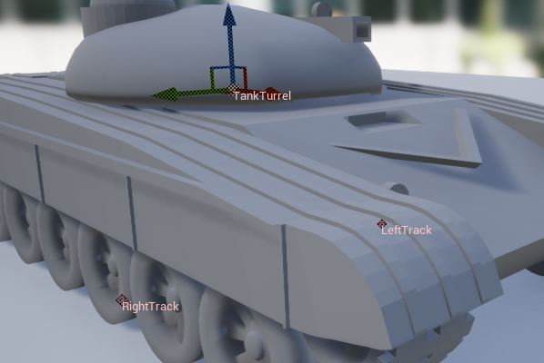
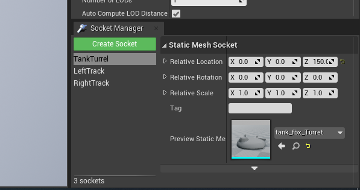
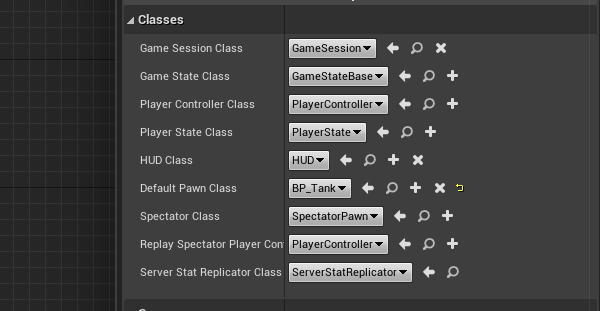
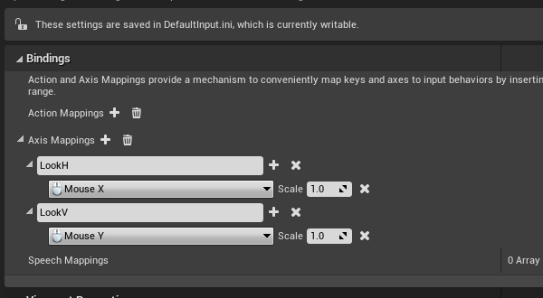
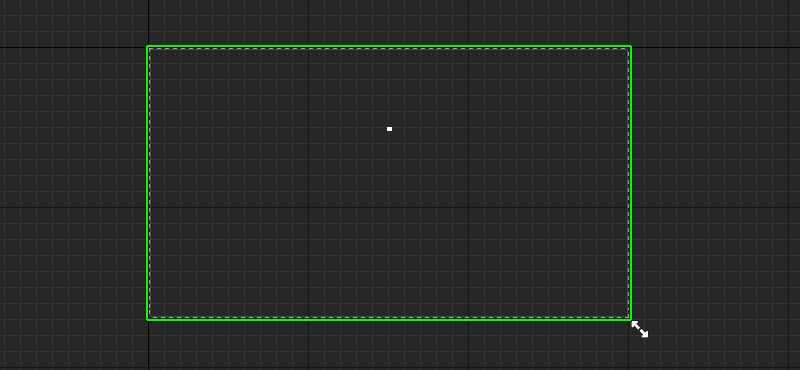
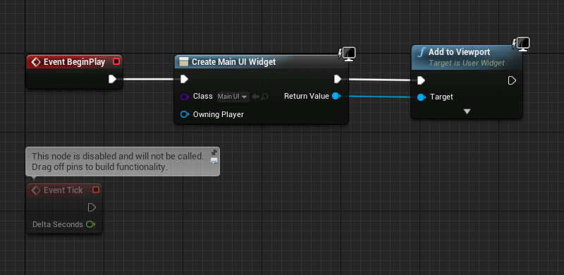

> # 坦克大战
> 学习坦克大战游戏过程中遇到的知识点
> 
> https://www.taikr.com/my/course/864

## Task2 导入tank模型

**Socket**
  * 在导入模型之后，为了将模型合理的放在位置，可以在Mesh Editor里面预览位置 
    
    

## Task3 坦克视角控制

**GameModeBase**
  * 控制游戏初始时默认的一些`class`, 基于创建项目时的`GameModeBase`创建一个蓝图GameMode, 方便通过蓝图设置。
    <br><br/>
  * 在`GameModeBase`中可以设置运行时默认的一些`Classes`
  * 在`ProjectSettings->Maps&Modes`中设置默认的`GameModeBase`。 
  * 在`BP_Tank(Pawn)`中设置默认的`AI Controller Class`
  * 设置好游戏开始时的`Default Pawn`之后，游戏开始时，就会进入该`Pawn`的视角，如果附加相机到`Pawn`上面，会显示相机的视角。

**视角旋转**
  * 首先要进行一个绑定操作，在`Edit->Project Settings->Input`进行绑定。
    <br><br/>
  * 在蓝图中使用绑定的`Input`
    <br><br/>
  * 应该使用两个组件，分别控制`水平方向`和`竖直方向`的旋转，并且竖直方向的旋转控制组件应该是水平方向的的子组件。这样在进行竖直方向旋转时，水平方向的轴不会变化
    <br><br/>


## Task4 创建Controller

  * 创建`AIcontroller` 和 `PlayerController` 均继承于`Controller`类


    ``` C++
    // 重要代码
      AMyTank* ATankAIController::GetControlledTank() {
        return Cast<AMyTank>(GetPawn()); //Cast 类型强制转换
      }
    ```
    ``` C++
      AMyTank* ATankAIController::GetPlayerTank() {
        return Cast<AMyTank>(GetWorld()->GetFirstPlayerController()->GetPawn());
      }
    ```

## Task5 LineTrace寻找瞄准点
  * 简单设置`UI`，用
    <br><br/>
  * 在`Controller` 里面，将`UI add to Viewport`  
    <br><br/>
  
  * **寻址瞄准点**
    > 寻找瞄准点的主要逻辑：首先获取到屏幕上`准星的位置(FVector2D)`，然后通过2D转3D，获得该位置的`三维世界位置(FVector3D)`和`指向的方向(FVector3D)`，该`方向`指的是`视野的方向`， 这样， 根据这个位置和方向，发出一条`射线`， 计算出`射线`与`物体`的碰撞点，就是坦克应该瞄准的点。
  * 核心代码
    ``` C++
    virtual void Tick(float DeltaTime) override;
    void AimToTarget();
    bool SightRayHitLoaction(FVector & HitLocation);
	bool LineHitLocation(FVector WorldLocation, FVector WorldDirection, FVector& HitLocation);

    void ATankPlayerController::Tick(float DeltaTime)
    {
	    AimToTarget(); //在Tick中, 每一帧都做瞄准的监测
    }
    void ATankPlayerController::AimToTarget() {

      FVector HitLoaction;      // 如果SightRay射到物体，执行转向
      if (SightRayHitLoaction(HitLoaction)) {
        // 执行转向
      }
    }

    bool ATankPlayerController::SightRayHitLoaction(FVector& HitLocation)
    {
    
      if (GEngine && GEngine->GameViewport)
        GEngine->GameViewport->GetViewportSize(ViewportSize); //获取屏幕的大小， 返回值为float类型， 为屏幕的像素
        FVector WorldLocation;
        FVector WorldDirection;
        FVector2D SightPosition = FVector2D(ViewportSize.X * CrosshairXLocation, ViewportSize.Y * CrisshairYLocation);
        DeprojectScreenPositionToWorld(SightPosition.X, SightPosition.Y, WorldLocation, WorldDirection);
      if (LineHitLocation(WorldLocation, WorldDirection, HitLocation)) {
        return true;
      }
      return false;
    }
    bool ATankPlayerController::LineHitLocation(FVector WorldLocation, FVector WorldDirection, FVector& HitLocation)
    {
      UE_LOG(LogTemp, Warning, TEXT("%s %s"), *WorldLocation.ToString(), *WorldDirection.ToString());
      FHitResult HitResult;
      if (GetWorld()->LineTraceSingleByChannel(
        HitResult,
        WorldLocation,
        WorldLocation + WorldDirection * LineTraceRange,
        ECollisionChannel::ECC_Visibility  
      )) {
        HitLocation = HitResult.Location;
        return true;
      }
      return false;
    }
    ```
    **关于DeprojectScreenPositionToWorld**
      ``` C++
      
      /**
      Convert 2D screen position to World Space 3D position and direction. Returns false if unable to determine value. 
      **/
      /**
      将鼠标的在屏幕上2D的位置，转换成游戏世界中三维的位置和方向
      **/
      UFUNCTION(BlueprintCallable, Category="Game|Player", meta = (DisplayName = "ConvertScreenLocationToWorldSpace", Keywords = "deproject"))
      bool DeprojectScreenPositionToWorld(float ScreenX, float ScreenY, FVector& WorldLocation, FVector& WorldDirection) const;


      bool APlayerController::DeprojectScreenPositionToWorld(float ScreenX, float ScreenY, FVector& WorldLocation, FVector& WorldDirection) const
      {
        return UGameplayStatics::DeprojectScreenToWorld(this, FVector2D(ScreenX, ScreenY), WorldLocation, WorldDirection);
      }
      

      bool UGameplayStatics::DeprojectScreenToWorld(APlayerController const* Player, const FVector2D& ScreenPosition, FVector& WorldPosition, FVector& WorldDirection)
      {
        ULocalPlayer* const LP = Player ? Player->GetLocalPlayer() : nullptr;
        if (LP && LP->ViewportClient)
        {
          // get the projection data
          FSceneViewProjectionData ProjectionData;
          if (LP->GetProjectionData(LP->ViewportClient->Viewport, eSSP_FULL, /*out*/ ProjectionData))
          {
            FMatrix const InvViewProjMatrix = ProjectionData.ComputeViewProjectionMatrix().InverseFast();//逆矩阵
            FSceneView::DeprojectScreenToWorld(ScreenPosition, ProjectionData.GetConstrainedViewRect(), InvViewProjMatrix, /*out*/ WorldPosition, /*out*/ WorldDirection);
            return true;
          }
        }
        // something went wrong, zero things and return false
        WorldPosition = FVector::ZeroVector;
        WorldDirection = FVector::ZeroVector;
        return false;
      }
    ```
    从NDC坐标到世界坐标转换的数学原理
    http://www.likecs.com/show-53863.html